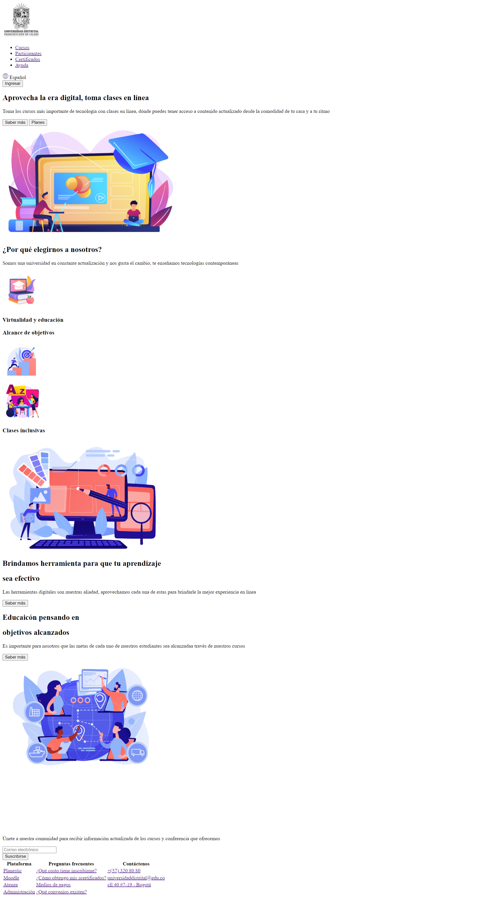

<h1> Taller 9: Ketlly Bautista </h1>
<h2> Información</h2>

Curso: Full Stick Básico- Grupo 1

Profesor: Cristian Patiño

<h2>Punto 1: Link de figma</h2><a href= "https://www.figma.com/file/nvyiFbAgfriPSXDZ6jgt9A/Ket-Bautista--Figma-Excercise?type=design&t=8sVWG8pG1Yy27CML-6">link de Figma</a>
<h2> Punto 2: HTML</h2>

<h2>Punto 3: CSS</h2>
